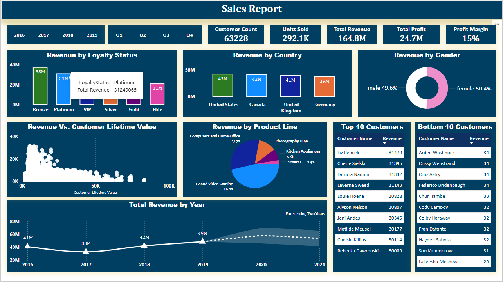
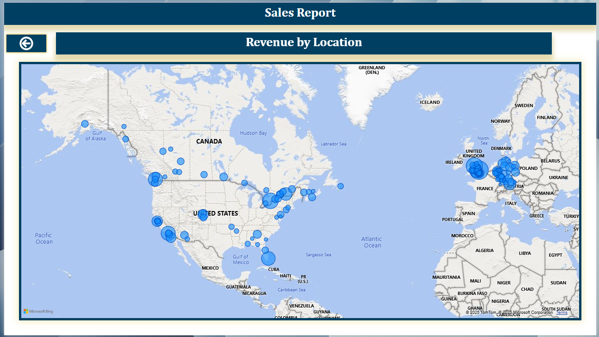
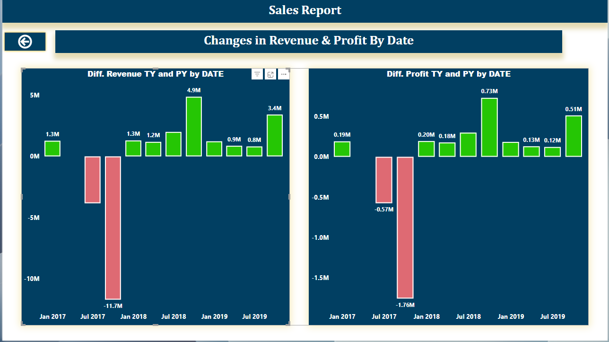

# 📊 Sales Performance Dashboard – Power BI Project

This Power BI project presents an interactive sales dashboard built from a dataset containing over 63,000 records and 29 columns. The report was created as a personal project to analyze monthly sales performance, forecast future revenue, and uncover trends in customer behavior and product performance.

---

## 🚀 Project Objectives

- Analyze **Quarterly sales performance** across regions and segments
- Forecast **future revenue** using built-in Power BI forecasting
- Identify **top-selling products** and customer demographics
- Showcase **advanced Power BI capabilities** (DAX, drill-through, tooltips, bookmarks)

---

## 📁 Dataset Overview

- **Source**: [data.csv](Data\src\CustomerLoyaltyProgram.csv)
- **Size**: 63,228 rows × 29 columns
- **Format**: CSV
- **Content**: Sales transactions including customer details, product lines, pricing, profit, location, and more

---

## 📌 Key KPIs

- Total Revenue  
- Total Profit  
- Profit Margin  
- Units Sold  
- Customer Count  

---

## 📊 Visuals & Features

- Bar Charts  
- Line Graphs  
- Donut Chart  
- Scatter Plot  
- Slicers (for dynamic filtering)  
- Drill-through Pages  
- Custom Tooltips  
- Forecasting (Power BI time series)  
- Bookmarks and Navigation  
- Parameters for dynamic data filtering  

---

## 🧹 Data Preparation

- Data cleaned and merged using **Power Query**
- Applied transformations to handle nulls, fix column types, and split fields
- Created calculated columns and **DAX measures** for KPIs and trends

---

## 🔍 Key Insights

- **Top buyers by loyalty**: Bronze status
- **Top region**: United States
- **Top gender**: Female customers
- **Best-selling product lines**: TVs and Video Games
- **Forecast**: Revenue projected to increase over the next two years

---

## 🛠️ Tools & Technologies

- Microsoft Power BI Desktop  
- Power Query (M Language)  
- DAX (Data Analysis Expressions)   

---

## 📌 Screenshots

  

  

  

---

## 📬 Contact

If you have any questions or feedback, feel free to reach out via [LinkedIn](https://linkedin.com/in/eslam-hamza-ba8393315) or [email](mailto:ieslamhamza@gmail.com).

